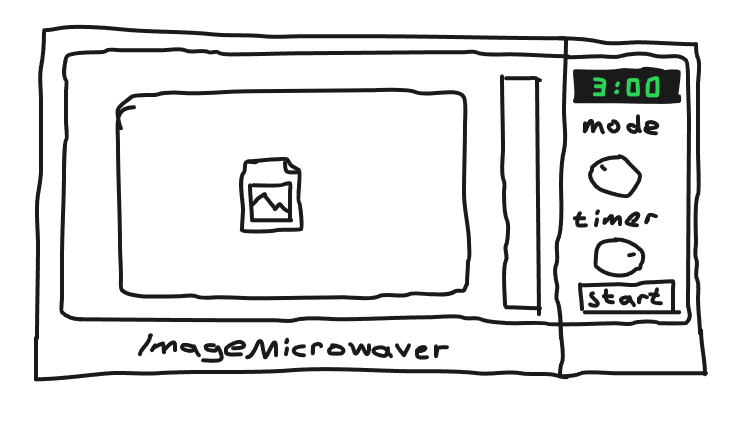
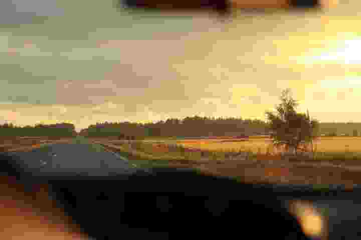
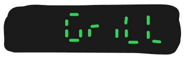
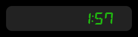
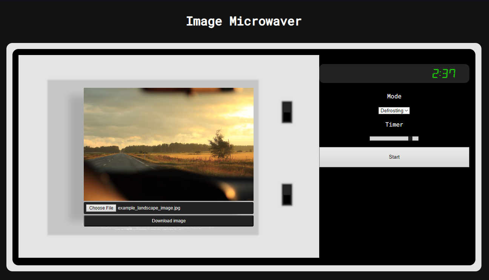

# Image Microwaver

Web application for image manipulation.



## Usage

1. Upload image
2. Close [Door](#door)
3. Select [Mode](#mode)
4. Select [Time](#time)
5. Press [Start](#start)

After the image has been processed, it can be downloaded by opening the door and hitting the download button.

## Modes

<a name="mode"></a>

Mode defines how the image will be processed.

Mode can be selected using Mode-selector. Selected mode is updated on the display.

### Normal

Scales image horizontally. Positive values make the image wider, negative values thinner.


### Defrosting

Controls image saturation. Positive values increase saturation, negative values decrease.


### Grill

Reduces jpg quality. Great for reducing file size. Be careful not to grill too much.



### Popcorn

Reduces resolution. Great for reducing file size.


## Timer (Intensity)

<a name="time"></a>

Timer defines how much strongly the selected mode is applied to the image.

Time can be selected by Timer-selector. Selected time is updated on the display.

## Start

<a name="start"></a>

Processes the image with currently selected mode and intensity.

Locks all controls until image has been processed.

## Display

Display shows currently selected mode / time, according to which one has been modified last time.

- Displays "Done!" after image has been successfully processed
- Displays "Error" if something went wrong
- Displays "Close door" if door is left open when Start is pressed




## Door

<a name="door"></a>

Microwave door is open by default and can be closed by clicking anywhere inside the microwave (not the upload link!).

When the door is open, the image can be downloaded or new image can be uploaded.

- Door closes automatically when user hits start and opens when image has been processed
- The door is semi-transparent and the image inside can be seen spinning with light on while the image is being processed
- Can't be opened while the image is being processed



## How to setup

- Clone repository to desired directory
- Run following command in the root directory to install dependencies (requires npm):

```bash
npm install
```

- Run following command to start server:

```bash
npm run dev
```

- Setup API for image processing: https://github.com/khakomaki/image_microwaver_api
- Check that both servers and communication is working by uploading and processing example image
