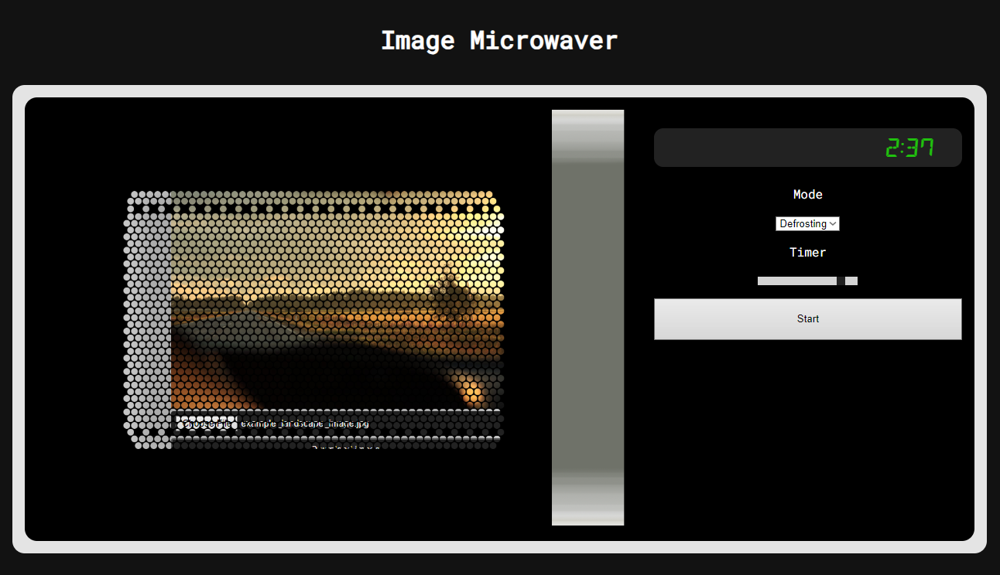

# Image Microwaver

Web application for image manipulation.

## Usage

1. Upload image (max. 2MB)
2. Close [door](#door)
3. Select [mode](#mode)
4. Select [time](#time)
5. Press [start](#start)

After the image has been processed, it can be downloaded by opening the door and hitting the download button.

## Modes

Mode defines how the image will be processed.

Mode can be selected using Mode-knob. Rotating the knob shows the current selection on the screen.

### Normal

Increases image contrast.

### Defrosting

Increases image saturation.

### Grill

Reduces jpeg quality.

### Popcorn

Adds noice to image.

## Timer (Intensity)

Timer defines how much strongly the selected mode is applied to the image.

Time can be selected by Timer-knob. Rotating the knob shows the current selection on the screen.

## Start

Processes the image with currently selected mode and intensity.

## Screen

Screen shows currently selected mode / time, according to which one has been modified last time.

Displays "done!" after image has been successfully processed or "error" if something went wrong.

## Door

Microwave door is open by default and can be closed by clicking anywhere inside the microwave (not the upload link!).

When the door is open, the image can be downloaded or new image can be uploaded.

- Door closes automatically when user hits start and opens when image has been processed
- The door is semi-transparent and the image inside can be seen spinning with light on while the image is being processed
- Can't be opened while the image is being processed

